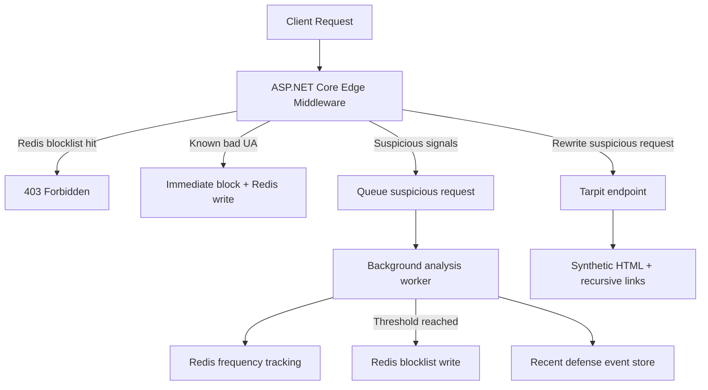

# System Architecture (.NET)

This repository is moving toward a pure-.NET version of the upstream `ai-scraping-defense` platform. Commercial v1 is intentionally a single ASP.NET Core application that already exposes the same core roles as the upstream stack, but keeps them in-process while the .NET service boundaries settle.

## Current Components

### Edge Inspection

The request pipeline begins in [RedisBlocklistMiddlewareApp/RedisBlocklistMiddleware.cs](../RedisBlocklistMiddlewareApp/RedisBlocklistMiddleware.cs).

Responsibilities:

- Resolve the client IP, honoring forwarded headers only from configured trusted proxies.
- Reject IPs already present in the Redis blocklist.
- Block known bad user agents immediately.
- Flag suspicious requests based on headers, query size, and request path.
- Rewrite suspicious requests into the tarpit route.
- Enqueue suspicious requests for asynchronous analysis.

### Queued Analysis

Suspicious requests are written to a bounded channel by [RedisBlocklistMiddlewareApp/Services/SuspiciousRequestQueue.cs](../RedisBlocklistMiddlewareApp/Services/SuspiciousRequestQueue.cs).

The background worker in [RedisBlocklistMiddlewareApp/Services/DefenseAnalysisService.cs](../RedisBlocklistMiddlewareApp/Services/DefenseAnalysisService.cs) performs the first .NET-native version of the upstream AI-service and escalation-engine flow:

- Consume suspicious requests asynchronously.
- Update per-IP frequency counters in Redis.
- Compute a score from the collected request signals.
- Apply optional configured-range reputation, HTTP reputation, and OpenAI-compatible model contributions.
- Promote high-risk or high-frequency IPs into the Redis blocklist.
- Store recent decisions and their score breakdown in the persistent audit/event store.

### Webhook Intake

The upstream AI-service webhook role is now represented by `POST /analyze` in [RedisBlocklistMiddlewareApp/Program.cs](../RedisBlocklistMiddlewareApp/Program.cs). Accepted webhook events are written durably through [RedisBlocklistMiddlewareApp/Services/SqliteWebhookEventInbox.cs](../RedisBlocklistMiddlewareApp/Services/SqliteWebhookEventInbox.cs), and [RedisBlocklistMiddlewareApp/Services/WebhookIntakeProcessingService.cs](../RedisBlocklistMiddlewareApp/Services/WebhookIntakeProcessingService.cs) consumes them asynchronously.

Current behavior:

- Requires an intake API key when the endpoint is enabled.
- Accepts webhook events in the legacy AI-service shape.
- Persists accepted events before processing.
- Promotes the flagged IP into the Redis blocklist and records a defense decision.

### Redis State

The app uses Redis for the same categories of fast-moving state as the upstream stack:

- Blocklist state via [RedisBlocklistMiddlewareApp/Services/RedisBlocklistService.cs](../RedisBlocklistMiddlewareApp/Services/RedisBlocklistService.cs)
- Short-window frequency tracking via [RedisBlocklistMiddlewareApp/Services/RedisRequestFrequencyTracker.cs](../RedisBlocklistMiddlewareApp/Services/RedisRequestFrequencyTracker.cs)
- Community blocklist imports via [RedisBlocklistMiddlewareApp/Services/CommunityBlocklistSyncRunner.cs](../RedisBlocklistMiddlewareApp/Services/CommunityBlocklistSyncRunner.cs)

This is the first step toward the upstream pattern where Redis holds blocklist, counters, and other operational signals.

### Community Blocklist Sync

The upstream public-blocklist sync role is now represented by [RedisBlocklistMiddlewareApp/Services/CommunityBlocklistSyncService.cs](../RedisBlocklistMiddlewareApp/Services/CommunityBlocklistSyncService.cs).

Current behavior:

- fetches one or more configured community feeds on a timer
- accepts either a raw JSON array of IP strings or `{ \"ips\": [...] }`
- rejects invalid, loopback, link-local, and private addresses
- writes accepted entries into the existing Redis blocklist service
- exposes last-run status through the authenticated management API

### Tarpit Surface

Requests rewritten to `/anti-scrape-tarpit/{path}` are served by the minimal API endpoint in [RedisBlocklistMiddlewareApp/Program.cs](../RedisBlocklistMiddlewareApp/Program.cs). Content is generated by [RedisBlocklistMiddlewareApp/Services/TarpitPageService.cs](../RedisBlocklistMiddlewareApp/Services/TarpitPageService.cs).

Current behavior:

- Deterministic synthetic HTML based on request path and seed.
- Recursive synthetic links to keep crawlers occupied.
- Configurable response delay to simulate low-value slow streaming.

## Current Flow

## Intended Evolution

This app is intentionally shaped so it can be split into separate .NET services as parity work continues:

- Edge gateway
- AI intake/webhook
- Escalation engine
- Tarpit API
- Admin API/UI
- Blocklist sync workers

The commercial-v1 scope is documented in [docs/commercial_scope.md](commercial_scope.md). The post-v1 split and parity work is documented in [docs/dotnet_parity_roadmap.md](dotnet_parity_roadmap.md).
