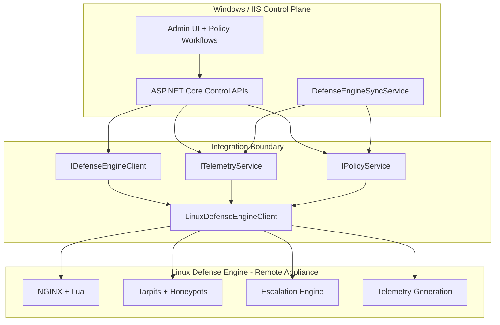

# IIS Control Plane + Linux Defense Engine Architecture

This document describes the post-refactor split between the two related repositories:

- **Execution engine (Linux, source of truth):** `ai-scraping-defense`
- **Enterprise control plane (Windows/IIS):** `ai-scraping-defense-iis` (this repository)

## Design Principle

The IIS project must **integrate with** the Linux defense stack, not recreate it.

### Explicit Non-Goals for IIS

- No Lua/NGINX detection logic port
- No duplicate bot-classification pipeline in C#
- No forked tarpit or escalation algorithm

## Layered Model

## IIS Control Plane Components

- **`IDefenseEngineClient`**: abstraction for health, telemetry retrieval, policy submission, and escalation acknowledgment.
- **`LinuxDefenseEngineClient`**: HTTP adapter with timeout/retry and fallback behavior.
- **`ITelemetryService` / `TelemetryService`**: orchestration-level telemetry cache and refresh.
- **`IPolicyService` / `PolicyService`**: policy push workflow and deferred queue synchronization.
- **`DefenseEngineSyncService`**: periodic pull/push background synchronization.

## Provisional Linux API Contract

Until Linux APIs are formally versioned, the IIS adapter targets:

- `GET /health`
- `GET /api/v1/telemetry`
- `POST /api/v1/policies`
- `POST /api/v1/escalations/ack`

If endpoints differ, update only the adapter/client layer while preserving IIS control-plane interfaces.
